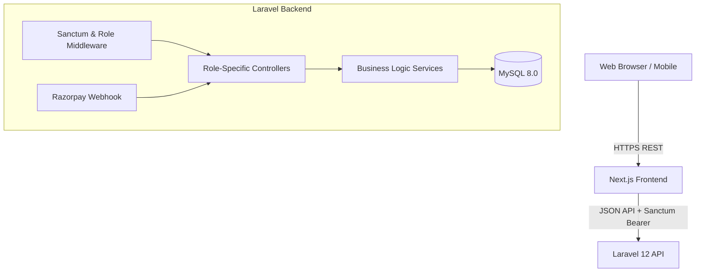
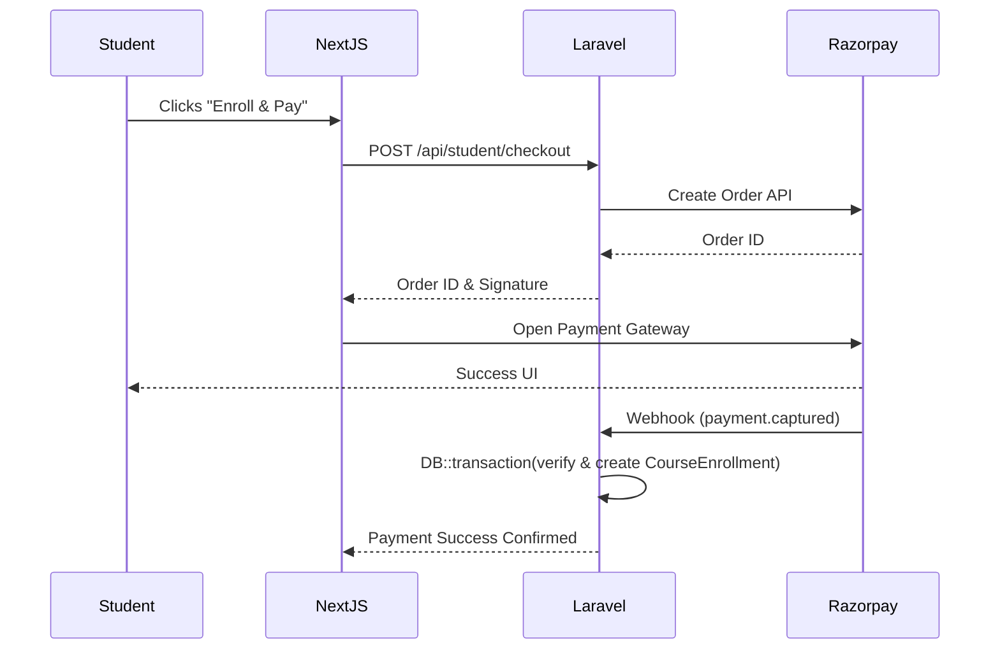

# System Architecture

**BlueBoxx DA** is built on a modern, decoupled monolithic architecture separating the frontend client (Next.js) from the backend API (Laravel).

## 1. High-Level Architecture Diagram

## 2. Frontend Architecture (Next.js)
- **Framework:** Next.js 14 utilizing the Pages Router (`/pages`).
- **State Management:** Local state via `useState/useReducer`, global caching via `SWR`, and global UI state via `Zustand`.
- **Styling:** Tailwind CSS combined with `clsx` and `tailwind-merge` for dynamic component classes.
- **Data Fetching:** Axios instance configured in `src/lib/axios.ts` intercepts requests to attach Sanctum Bearer tokens securely.

## 3. Backend Architecture (Laravel 12)
- **Framework:** Laravel 12 API-only configuration.
- **Routing:** Complex Role-Based routing defined in `routes/api.php` grouped strictly by prefix (`/admin`, `/student`, `/company`).
- **Authentication:** Laravel Sanctum handles stateful SPA authentication and API token generation.
- **Database Interaction:** Eloquent ORM utilizing strict Eager Loading (`with()`) to prevent N+1 issues and robust `DB::transaction()` closures for financial and multi-table insertions.

## 4. Payment Flow Architecture

## 5. Design Principles
1. **Separation of Concerns:** Business logic resides in Controllers/Services, strictly separated from routing and view layers.
2. **Fail-Safe Integrity:** All multi-table insertions (e.g., Job + Application) are wrapped in `DB::transaction()`.
3. **Role Isolation:** Endpoints for an `Intern` can mathematically never be accessed by a `Student` due to strict Sanctum ability checks.
