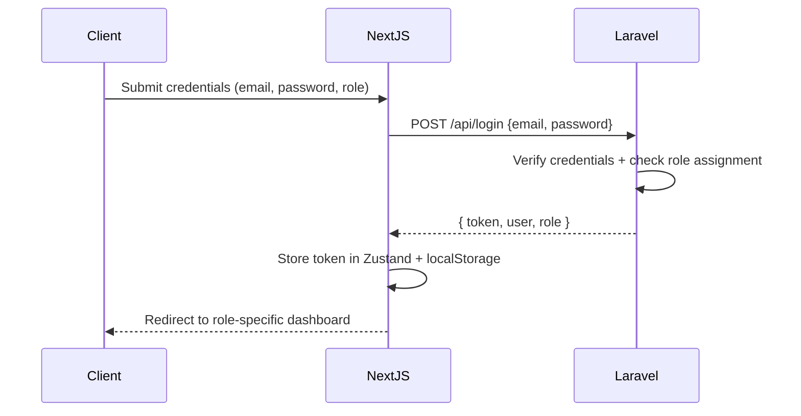

# Authentication Documentation

BlueBoxx DA uses **Laravel Sanctum** for stateless API token authentication across all 7 portals.

## 1. Overview

| Flow | Mechanism |
| :--- | :--- |
| API Authentication | Sanctum Personal Access Tokens (Bearer) |
| Token Abilities | Role-scoped abilities (`role:student`, `role:admin`, etc.) |
| Password Reset | Signed email link with time-limited token |
| Session Isolation | Each role gets a completely separate token |

## 2. Login Flow



## 3. API Routes

| Endpoint | Method | Description |
| :--- | :--- | :--- |
| `/api/login` | POST | Authenticate user, return Sanctum token |
| `/api/register` | POST | Register a new user account |
| `/api/logout` | POST | Revoke current token |
| `/api/forgot-password` | POST | Send password reset email |
| `/api/reset-password` | POST | Submit new password with signed token |

## 4. Middleware Stack

Every protected route is wrapped with two middleware layers:

```php
// routes/api.php
Route::middleware(['auth:sanctum', 'role:student'])
    ->prefix('student')
    ->group(function () {
        // Student-only routes here
    });
```

- **`auth:sanctum`** — Validates the Bearer token exists and is valid.
- **`role:{role_name}`** — Ensures the authenticated user's role matches the route group. Any mismatch returns `403 Forbidden`.

## 5. Token Structure

Tokens contain **abilities** issued at login:
```php
$token = $user->createToken('auth_token', ['role:' . $user->role])->plainTextToken;
```

## 6. Security Notes

- Tokens are **not stored** in frontend cookies (XSS-safe).
- Tokens are stored in `localStorage` and injected as `Authorization: Bearer {token}` headers via the Axios interceptor in `src/lib/axios.ts`.
- The `logout` endpoint deletes only the **current** token, preserving multi-device sessions.
- **Failed login attempts** are rate-limited to 5 per minute per IP using `throttle:5,1` middleware.
